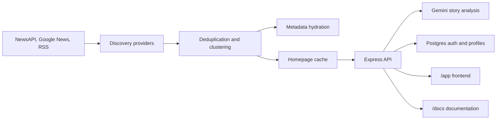

# Zelthir

Zelthir is a production-oriented news intelligence app. It discovers current U.S. and world coverage, clusters articles about the same event, hydrates article metadata, and uses Gemini to produce structured story intelligence: a grounded brief, claim ledger, disputed claims, coverage framing, connected topic map, watch signals, and ripple effects.

The app has three local development services:

- Postgres for users, sessions, OAuth accounts, login codes, and profile preferences.
- The Express backend on `http://127.0.0.1:3210` for APIs, auth, ingestion, static serving, and health checks.
- The Vite frontend on `http://127.0.0.1:5173` for fast local UI development with `/api` proxied to the backend.

In production, `server.mjs` is the Vercel serverless entrypoint and can also serve the static frontend from `public/` when `SERVE_STATIC` is not set to `false`.

## Current Product

Zelthir ships:

- A live front page at `/app/` with lead coverage, latest clusters, U.S. coverage, world coverage, and personalized views.
- News discovery from NewsAPI when configured, with Google News and RSS broad coverage as fallback and supplement.
- Heuristic clustering, article deduplication, section ranking, image proxying, and article preview metadata recovery.
- Gemini-backed story analysis from `/api/ai/story?clusterId=...`.
- Google OAuth sign-in, development email-code sign-in, session cookies, and persisted reader profiles.
- Product and deploy documentation served from `/docs/`.

## Architecture



The homepage cache is written to `data/homepage-cache.json` during local runtime. If upstream discovery fails or no cache exists, the backend falls back to the bundled sample homepage payload.

## Local Setup

Install dependencies:

```bash
npm install
```

Create a local `.env` file with placeholders replaced by real values:

```bash
DATABASE_URL=postgres://<user>:<password>@127.0.0.1:5432/<database>
GEMINI_API_KEY=<gemini-api-key>
NEWS_API_KEY=<news-api-key-or-empty>
GOOGLE_CLIENT_ID=<google-oauth-client-id>
GOOGLE_CLIENT_SECRET=
AUTH_HASH_SECRET=<long-random-secret>
SESSION_SECRET=<long-random-secret>
API_BASE_URL=http://127.0.0.1:3210
FRONTEND_ORIGIN=http://127.0.0.1:5173
```

Start Postgres:

```bash
npm run dev:db
```

Run migrations:

```bash
npm run db:migrate
```

Start the backend:

```bash
npm run dev:backend
```

Start the frontend in another shell:

```bash
npm run dev:frontend
```

Open:

- `http://127.0.0.1:5173/` for the Vite frontend.
- `http://127.0.0.1:3210/app/` for the backend-served frontend.
- `http://127.0.0.1:3210/docs/` for the documentation viewer.
- `http://127.0.0.1:3210/api/health` for service health.

## Environment Variables

Required for a production-like app:

- `DATABASE_URL`: Postgres connection string. Required by storage and migrations.
- `GEMINI_API_KEY`: Gemini API key for story analysis.
- `GOOGLE_CLIENT_ID`: Google OAuth client ID.
- `GOOGLE_CLIENT_SECRET`: Google OAuth client secret.
- `AUTH_HASH_SECRET` or `SESSION_SECRET` or `AUTH_SECRET`: HMAC secret for email login-code hashes. Production requires one of these.
- `SESSION_SECRET`: Recommended session-related secret; also accepted as the auth hash secret fallback.
- `API_BASE_URL`: Public backend base URL. Used by scripts and OAuth redirect defaults.
- `FRONTEND_ORIGIN`: Allowed frontend origin and OAuth return URL.

Optional runtime configuration:

- `PORT`: Backend port. Defaults to `3210`.
- `SERVE_STATIC`: Set to `false` to disable backend static serving.
- `BACKEND_PUBLIC_URL`: Additional allowed backend origin and OAuth redirect base.
- `GOOGLE_OAUTH_REDIRECT_URI`: Explicit Google OAuth callback URL. Defaults to `${API_BASE_URL}/api/auth/google/callback` when set, otherwise `${BACKEND_PUBLIC_URL}/api/auth/google/callback`.
- `SESSION_COOKIE_NAME`: Session cookie name. Defaults to `zelthir_session`.
- `SESSION_DAYS`: Session lifetime in days. Defaults to `30`.
- `EMAIL_CODE_AUTH_ENABLED`: Enables email-code sign-in in production only when set to `1`, `true`, or `yes`. In development, email-code sign-in is available and logs codes to the backend console.
- `NEWS_API_KEY`: NewsAPI key. If missing or NewsAPI fails, discovery falls back to Google News plus RSS.
- `DISCOVERY_PROVIDER`: Use `rss` to skip NewsAPI. Any other value uses the NewsAPI path with broad fallback.
- `NEWS_REFRESH_TIMEOUT_MS`: News discovery request timeout. Defaults to `12000`.
- `NEWS_EXPANSION_SEED_COUNT`: NewsAPI seed expansion count. Defaults to `5`.
- `NEWS_MAX_SECTION_CLUSTERS`: Max clusters per section. Defaults to `8`.
- `GOOGLE_NEWS_SEED_COUNT`: Google News seed count. Defaults to `8`.
- `NEWS_AUTO_REFRESH_MINUTES`: Local backend refresh interval. Defaults to `2`.
- `NEWS_STALE_AFTER_MINUTES`: Cache staleness threshold. Defaults to `4`.
- `AI_PROVIDER`: Production default is `gemini`.
- `GEMINI_MODEL`: Gemini model name. Defaults to `gemini-2.5-flash`.
- `AI_TIMEOUT_MS`: AI analysis timeout. Defaults to `90000`.
- `NODE_ENV`: Set to `production` in deploys for secure cookies and production headers.

Do not commit `.env` or real credentials.

## Database And Migrations

Migrations live in `migrations/` and are applied by `src/db/migrate.mjs`:

```bash
npm run db:migrate
```

Current schema:

- `001_init.sql`: Creates `users`, `login_codes`, `sessions`, `profiles`, `profile_interests`, and `profile_locations`.
- `002_oauth_accounts.sql`: Creates `oauth_accounts` and provider-user uniqueness for Google sign-in.

The migration runner reads every `.sql` file in sorted order and wraps each file in a transaction. The SQL uses `create table if not exists` and `create index if not exists`, so repeated local runs are expected.

## Backend Routes

Frontend and docs:

- `GET /`: Redirects to `/app/` when static serving is enabled.
- `GET /app/`: Serves the product UI from `public/`.
- `GET /docs/`: Serves the docs viewer from the repository root assets.

News and analysis:

- `GET /api/home`: Returns the decorated cached homepage payload and triggers background refresh when stale.
- `POST /api/refresh`: Runs homepage discovery immediately and returns the refreshed payload.
- `GET /api/ai/story?clusterId=...`: Finds a cached cluster and returns Gemini story intelligence.
- `GET /api/image?url=...`: Proxies remote article images with basic validation and caching headers.
- `GET /api/article-preview?url=...`: Fetches title, description, final URL, and image metadata for an article.
- `GET /api/sources`: Returns source registry diagnostics.
- `GET /api/taxonomy`: Returns supported personas, interests, and location types.
- `GET /api/health`: Checks backend, database, and Gemini key configuration.

Authentication and profile:

- `GET /api/auth/options`: Reports enabled sign-in providers.
- `POST /api/auth/start`: Starts development email-code sign-in when enabled.
- `POST /api/auth/verify`: Verifies an email code, creates a user/session, and returns profile state.
- `GET /api/auth/google/start`: Starts Google OAuth.
- `GET /api/auth/google/callback`: Handles Google OAuth, creates or links the user, and sets the session cookie.
- `POST /api/logout`: Clears the session cookie and deletes the stored session.
- `GET /api/me`: Returns the current user and profile when authenticated.
- `PATCH /api/me/profile`: Updates display name, persona, interests, and locations.

## Deploy Steps

1. Provision Postgres and set `DATABASE_URL`.
2. Configure Google OAuth with an authorized callback URL at `<API_BASE_URL>/api/auth/google/callback`, or set `GOOGLE_OAUTH_REDIRECT_URI` explicitly.
3. Set production environment variables in Vercel: `DATABASE_URL`, `GEMINI_API_KEY`, `GOOGLE_CLIENT_ID`, `GOOGLE_CLIENT_SECRET`, `AUTH_HASH_SECRET`, `SESSION_SECRET`, `API_BASE_URL`, `FRONTEND_ORIGIN`, `NODE_ENV=production`, and any desired news/discovery settings.
4. Run migrations against the production database:

```bash
npm run db:migrate
```

5. Deploy with the Vercel configuration in `vercel.json`, which routes all requests to `server.mjs`.
6. Verify health and the main product route:

```bash
npm run check:health
```

Then open `/app/`, sign in with Google, save profile preferences, refresh coverage, and open a story analysis modal.

## Checks

Useful checks before pushing or deploying:

```bash
npm run db:migrate
npm run check:health
npm run ingest
npm run check:taxonomy
npm run check:sources
npm run check:sources -- --include-candidates
npm run check:ai
git diff --check
```

Notes:

- `npm run check:health` expects a running backend and uses `API_BASE_URL` or `http://127.0.0.1:3210`.
- `npm run ingest` writes the homepage cache under `data/`.
- `npm run check:ai` expects `data/homepage-cache.json` to contain at least one cached cluster and requires Gemini configuration.
- `npm run check:sources` touches remote RSS feeds and may fail because of upstream feed availability.

## Codebase Map

Root runtime files:

- `server.mjs`: Express app and Vercel entrypoint. Registers security headers, CORS, health/auth/profile/taxonomy/source routes, static serving, homepage cache refresh, image proxying, article previews, story analysis, manual refresh, and local warm-cache scheduling. Important functions include `isCacheStale`, `decorateHome`, `findClusterById`, `refreshHome`, `ensureFreshHome`, `warmHomeCache`, `applyProductionHeaders`, and `applyCorsHeaders`.
- `package.json`: Defines local scripts for backend, frontend, database, migrations, health checks, source checks, ingestion, and production start.
- `docker-compose.yml`: Defines the local Postgres service and persistent Docker volume.
- `vercel.json`: Routes all production requests to `server.mjs`.
- `vite.config.mjs`: Serves `public/` on `127.0.0.1:5173` and proxies `/api` to the backend.
- `index.html`, `app.js`, `styles.css`: Docs viewer shell, renderer, and styles for the architecture notes.
- `PRODUCT_ARCHITECTURE.md`: Product architecture and planning document rendered by the docs viewer.

Frontend files:

- `public/index.html`: Product UI markup for masthead, account controls, live ticker, lead story, personalized sections, U.S./world panels, story modal, sign-in modal, and profile controls.
- `public/app.js`: Browser application logic. It loads homepage data, manages account/profile state, renders story clusters, builds fallback intelligence, calls live AI analysis, renders story modals, handles sign-in/sign-out, saves profile preferences, fetches article previews, and drives tab/modal interactions. Important functions include `loadMe`, `saveProfilePrefs`, `loadHomepage`, `refreshHomepage`, `getStoryIntelligence`, `loadAiIntelligence`, `mergeAiIntelligence`, `renderHomepage`, `renderModal`, `startEmailLogin`, `verifyEmailLogin`, and `signOut`.
- `public/styles.css`: Product UI styles for the live news app.

AI and schemas:

- `src/ai/storyAnalysisProvider.mjs`: Selects the configured story analysis provider. The production path is `AI_PROVIDER=gemini`.
- `src/ai/geminiStoryAnalysis.mjs`: Builds the story prompt, calls Gemini, parses JSON, normalizes output into UI fields, validates schema-shaped payloads, caches responses, and supplies fallback fields when the model output is partial. Important exports include `StoryAnalysisProviderError`, `analysisToSchemaPayload`, `validateStoryAnalysisPayload`, and `analyzeClusterWithGemini`.
- `schemas/story-analysis.schema.json`: JSON schema for story intelligence payloads.
- `schemas/top-stories.schema.json`: JSON schema for top-story data shape.

Database and storage:

- `src/db/pool.mjs`: Creates the shared Postgres pool from `DATABASE_URL` and exports `query` and `closePool`.
- `src/db/migrate.mjs`: Lists sorted SQL migration files and applies each migration in a transaction.
- `src/storage/index.mjs`: Re-exports storage operations from the Postgres store.
- `src/storage/postgresStore.mjs`: Implements user, login-code, session, OAuth-account, and profile persistence. Important exports include `createUserByEmail`, `findUserByEmail`, `findOrCreateOAuthUser`, `createLoginCode`, `consumeLoginCode`, `createSession`, `findSession`, `deleteSession`, `getProfile`, and `updateProfile`.

Server modules:

- `src/server/healthRoutes.mjs`: Implements `GET /api/health` and checks database connectivity plus Gemini key presence.
- `src/server/authRoutes.mjs`: Implements auth options, email-code development auth, Google OAuth, session creation, logout, user sanitization, and OAuth redirect handling.
- `src/server/profileRoutes.mjs`: Implements authenticated profile reads and updates with payload validation and response sanitization.
- `src/server/sessionCookies.mjs`: Centralizes session cookie config, token creation, expiry, hashing, cookie reads, cookie writes, and cookie clearing.
- `src/server/sourceRoutes.mjs`: Exposes source registry diagnostics at `/api/sources`.
- `src/server/taxonomyRoutes.mjs`: Defines the supported personas, interests, and location types returned by `/api/taxonomy`.

Ingestion modules:

- `src/ingest/config.mjs`: Loads environment configuration and runtime defaults.
- `src/ingest/discoveryAgent.mjs`: Orchestrates homepage discovery across sections, reads/writes the local homepage cache, merges discovery providers, runs clustering, and hydrates metadata.
- `src/ingest/newsApiProvider.mjs`: Queries NewsAPI top headlines and expanded related coverage.
- `src/ingest/googleNewsProvider.mjs`: Parses Google News RSS search feeds, normalizes items, and expands seed stories.
- `src/ingest/rssProvider.mjs`: Fetches configured RSS feeds and normalizes source diagnostics and articles.
- `src/ingest/rssDiscovery.mjs`: Provides RSS-only top-story discovery helpers.
- `src/ingest/sourceRegistry.mjs`: Defines active and candidate sources, source categories, section source coverage, and diagnostics.
- `src/ingest/clusterEngine.mjs`: Normalizes articles, deduplicates them, clusters related coverage, chooses canonical titles/summaries, scores clusters, and builds `whyItMatters`.
- `src/ingest/articleMetadata.mjs`: Resolves Google News URLs, extracts metadata, enriches article cards, deduplicates hydrated articles, and hydrates clusters with concurrency limits.
- `src/ingest/articleExtractor.mjs`: Extracts readable article excerpts from fetched HTML.
- `src/ingest/homeSample.mjs`: Provides the bundled fallback homepage payload.
- `src/ingest/sampleStories.mjs`: Contains sample story data used by ingestion or development flows.

Scripts:

- `scripts/run-ingest.mjs`: Runs homepage discovery and prints the resulting payload.
- `scripts/check-health.mjs`: Calls `/api/health` and exits nonzero when health fails.
- `scripts/check-gemini-analysis.mjs`: Loads the cached homepage, analyzes the first cluster, validates the schema-shaped output, and prints check counts.
- `scripts/check-sources.mjs`: Fetches active RSS sources, optionally including candidates, and reports feed/link acceptance failures.
- `scripts/check-taxonomy.mjs`: Verifies required persona, interest, and location-type IDs.

Migrations and docs:

- `migrations/001_init.sql`: Initial auth/profile schema.
- `migrations/002_oauth_accounts.sql`: Google OAuth account-linking schema.
- `docs/README.md`: Explains the documentation directory.
- `docs/ARCHITECTURE.md`: Architecture notes for the product and runtime.
- `docs/screenshots/`: Verification screenshots retained as documentation assets.

## Repository Hygiene

Ignored local artifacts include `.env`, `node_modules`, `.vercel`, generated homepage cache files under `data/`, local plans, and logs. Source files, migrations, scripts, docs, package metadata, and public assets should stay tracked.
