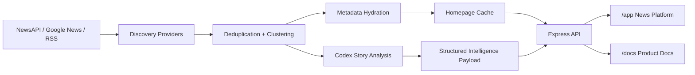

# Zelthir

Zelthir is an AI news intelligence platform that reads coverage from across the media spectrum, groups articles about the same event, extracts the facts they agree on, flags disputed claims, and generates a source-backed brief of the best-supported account of what happened. Instead of pushing one outlet's framing, it shows how different sources describe the same story, maps the connections between related events and actors, and highlights likely ripple effects so users can understand not just the headline, but what it means and what may happen next.

Zelthir combines a live news platform with an intelligence layer:

- a homepage that clusters large volumes of coverage into story-level events
- an AI-drafted story brief built from multi-source reporting
- a claim ledger that separates supported claims from disputed ones
- framing analysis across publisher coverage
- a predictive layer that surfaces ripple effects and what to watch next

## Platform Overview

Zelthir is built as a production-oriented Node and Express application with a multi-provider ingest pipeline, event clustering engine, metadata hydration layer, and Codex-backed structured analysis service.

The repository currently ships:

- live homepage discovery for U.S. and world coverage
- multi-source clustering with article counts and source counts
- image proxying and metadata recovery for better article cards
- on-demand Codex-backed story analysis through the backend
- a newsroom-style web UI with grouped article coverage and analysis tabs
- internal product and architecture documentation served from the same app

## What Makes The Product Intelligent

Zelthir does not summarize a single article. It constructs a story object from many related articles and uses that evidence set to generate structured intelligence.

For each story cluster, the intelligence layer can produce:

- `Grounded Brief`
  A clean, AI-drafted account of what the reporting most strongly supports.
- `Claim Ledger`
  Key supported claims with linked source evidence.
- `Disputed Claims`
  Open questions, conflicts, and low-confidence details surfaced separately.
- `Framing Matrix`
  A view of how the same event is framed across outlets.
- `Story Timeline`
  A compact evolution of the event across reporting times.
- `Ripple Effects`
  Likely `24h`, `7d`, and `30d` consequences.
- `What To Watch`
  Signals that would strengthen or weaken the current assessment.

## AI Stack

The live AI path in this repository uses the local `codex` CLI as the structured intelligence provider.

Current implementation:

- `src/ai/codexStoryAnalysis.mjs` builds an evidence-constrained prompt from clustered coverage.
- The backend runs `codex exec` and requests a strict JSON response.
- The response is normalized into product-ready fields for the UI:
  - headline
  - brief
  - drafted article paragraphs
  - agreed claims
  - disputed claims
  - framing
  - watch signals
  - ripple effects
- The frontend opens with a heuristic fallback and upgrades to live AI analysis when the Codex response returns.

This means the app uses authenticated Codex access on the machine rather than embedding a static provider key in the frontend.

## Predictive Intelligence

Zelthir includes a predictive intelligence layer in the story view. Today that predictive layer is generated through Codex-backed structured analysis plus story-graph heuristics already in the application.

What the current codebase does:

- estimates likely near-term consequences for each major story
- groups those consequences by `24h`, `7d`, and `30d`
- surfaces watch signals that would confirm or weaken the current outlook
- ties the forecast to the clustered evidence set rather than a single article

What it does not currently do:

- it does not run a separate MiroFish service
- it does not ship a Neo4j-backed prediction backend in this repo

If you want to integrate a dedicated prediction graph engine later, the current story-analysis contract is the right attachment point.

## Architecture At A Glance



## Runtime Surfaces

- `/app/`
  The live news platform UI with lead coverage, grouped stories, and analysis views.
- `/api/home`
  Returns the cached homepage payload.
- `/api/refresh`
  Re-runs discovery and rewrites the cached homepage payload.
- `/api/ai/story?clusterId=...`
  Generates live Codex-backed intelligence for a selected story cluster.
- `/api/image?url=...`
  Proxies article imagery for more reliable rendering.
- `/api/article-preview?url=...`
  Fetches article metadata for fallback image and snippet recovery.
- `/docs/index.html`
  Serves the internal PRD and architecture surface.

## Quick Start

```bash
npm install
cp .env.example .env
npm run dev
```

Open:

- `http://127.0.0.1:3210/app/`
- `http://127.0.0.1:3210/docs/index.html`

## Environment

```bash
NEWS_API_KEY=
DISCOVERY_PROVIDER=newsapi
NEWS_REFRESH_TIMEOUT_MS=12000
NEWS_EXPANSION_SEED_COUNT=5
NEWS_MAX_SECTION_CLUSTERS=8
GOOGLE_NEWS_SEED_COUNT=8
NEWS_AUTO_REFRESH_MINUTES=2
NEWS_STALE_AFTER_MINUTES=4
AI_PROVIDER=codex-cli
AI_TIMEOUT_MS=90000
```

Notes:

- If `NEWS_API_KEY` is empty, discovery falls back to Google News and direct RSS sources.
- `AI_PROVIDER=codex-cli` enables live story analysis through the locally authenticated Codex CLI.
- If Codex is unavailable, the UI still renders via heuristic story intelligence.
- Runtime cache files under `data/` are generated artifacts and are not committed.

## Project Structure

```text
.
|-- README.md
|-- TECHNICAL_PRD.md
|-- server.mjs
|-- public/
|   |-- index.html
|   |-- app.js
|   `-- styles.css
|-- src/
|   |-- ai/
|   |   `-- codexStoryAnalysis.mjs
|   `-- ingest/
|       |-- articleMetadata.mjs
|       |-- clusterEngine.mjs
|       |-- config.mjs
|       |-- discoveryAgent.mjs
|       |-- googleNewsProvider.mjs
|       |-- homeSample.mjs
|       |-- newsApiProvider.mjs
|       |-- rssProvider.mjs
|       `-- sourceRegistry.mjs
|-- docs/
|   |-- ARCHITECTURE.md
|   `-- README.md
`-- schemas/
```

## Operational Notes

- The server automatically refreshes homepage discovery on a time interval.
- Homepage rendering continues to work through cached payloads when upstream providers are unavailable.
- Story analysis is requested on demand so the platform can keep the homepage fast while still exposing deeper AI analysis per story.
- The image pipeline includes proxying and metadata fallback because many publishers block direct hotlinking.

## Current Boundaries

- Story clustering is heuristic rather than embedding-native.
- The predictive layer is AI-generated and structured, but it is not yet powered by a separate graph-runtime service such as MiroFish.
- There is no automated test suite in the repository yet.

## Documentation

- [Architecture](/Users/navilan/Documents/AIInfraPlan/docs/ARCHITECTURE.md)
- [Docs README](/Users/navilan/Documents/AIInfraPlan/docs/README.md)
- [Technical PRD](/Users/navilan/Documents/AIInfraPlan/TECHNICAL_PRD.md)
