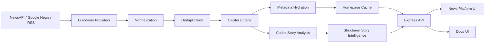

# Zelthir Architecture

Zelthir is a news platform with an attached intelligence layer. The system ingests broad coverage from multiple providers, normalizes and clusters related articles into a story object, enriches the story with better metadata, and then generates structured AI analysis for the selected cluster.

## System Goals

- collect fresh coverage from a broad source network
- collapse duplicated or closely related reporting into a single story cluster
- present that cluster as a newsroom-ready surface with reliable imagery and source visibility
- generate an AI-drafted best-supported account of what happened
- expose evidence, disputes, framing, and predictive signals without hiding uncertainty

## End-To-End Flow



## Runtime Components

### 1. Discovery Providers

Located under `src/ingest/`.

Responsibilities:

- fetch seed coverage from configured providers
- expand story candidates beyond a single homepage feed
- provide enough article breadth to create real multi-source clusters

Current providers:

- `newsApiProvider.mjs`
  Uses NewsAPI when a key is configured.
- `googleNewsProvider.mjs`
  Uses Google News feeds and search expansion to broaden coverage.
- `rssProvider.mjs`
  Uses direct publisher RSS feeds as a resilient fallback.

### 2. Normalization And Deduplication

Handled inside the ingest pipeline and cluster engine.

Responsibilities:

- convert heterogeneous provider payloads into one article shape
- normalize title, source, URL, snippet, timestamp, and image metadata
- remove exact duplicates and near-duplicate publisher rewrites

Normalized article shape:

```json
{
  "id": "string",
  "source": "string",
  "title": "string",
  "url": "string",
  "publishedAt": "ISO date",
  "snippet": "string",
  "imageUrl": "string|null",
  "section": "string",
  "language": "string"
}
```

### 3. Story Clustering

Primary file: `src/ingest/clusterEngine.mjs`

Responsibilities:

- compare article titles, snippets, timestamps, and source diversity
- merge related reporting into a single event-level story cluster
- choose a canonical title and representative imagery
- rank clusters for the homepage

Story cluster shape:

```json
{
  "clusterId": "string",
  "section": "usaDailyBriefing",
  "canonicalTitle": "string",
  "summary": "string",
  "whyItMatters": "string",
  "imageUrl": "string|null",
  "sourceCount": 103,
  "articleCount": 112,
  "latestPublishedAt": "ISO date",
  "articles": []
}
```

### 4. Metadata Hydration

Primary file: `src/ingest/articleMetadata.mjs`

Responsibilities:

- resolve Google News wrapper links to direct source URLs
- recover missing image, title, and description metadata
- improve publisher card quality when feed metadata is weak

This layer exists because publisher imagery is one of the most failure-prone parts of any news interface.

### 5. AI Story Analysis

Primary file: `src/ai/codexStoryAnalysis.mjs`

Responsibilities:

- build an evidence-constrained prompt from the cluster
- call the locally authenticated `codex` CLI
- request a strict JSON response rather than free-form prose
- normalize the AI output into product fields used by the UI

Structured analysis output:

```json
{
  "headline": "string",
  "brief": "string",
  "confidence": 82,
  "article_paragraphs": ["paragraph"],
  "agreed_claims": [],
  "disputed_claims": [],
  "frames": [],
  "watch_signals": [],
  "ripple_effects": {
    "24h": [],
    "7d": [],
    "30d": []
  }
}
```

This is the live AI path in the repository.

### 6. API Layer

Primary file: `server.mjs`

Responsibilities:

- serve the application shell and docs shell
- return cached homepage data
- trigger manual refreshes
- proxy remote imagery
- provide article metadata previews
- provide on-demand AI story analysis

Current endpoints:

- `GET /api/home`
- `POST /api/refresh`
- `GET /api/image?url=...`
- `GET /api/article-preview?url=...`
- `GET /api/ai/story?clusterId=...`

### 7. Frontend

Primary files:

- `public/index.html`
- `public/app.js`
- `public/styles.css`

Responsibilities:

- render the homepage, lead story, grouped story cards, and analysis modal
- show grouped source coverage for each cluster
- request AI analysis when a story is opened
- render the AI-drafted article, claim ledger, disputes, framing, connections, and predictive panels
- degrade gracefully when live AI or imagery is unavailable

## Intelligence Model

Zelthir uses a layered intelligence model.

### Base Layer

The homepage is built from provider feeds and the clustering engine.

Outputs:

- lead stories
- sectioned story grids
- grouped article rails
- source and article counts

### Story Intelligence Layer

Activated per cluster through `/api/ai/story`.

Outputs:

- AI-drafted article
- source-backed brief
- agreed claims
- disputed claims
- framing signals
- watch signals
- ripple effects

### Predictive Layer

The predictive layer is currently generated by structured Codex analysis plus internal story graph heuristics.

Outputs:

- likely near-term effects
- `24h / 7d / 30d` forecast buckets
- follow-up signals to monitor

Important accuracy note:

- this repository does **not** currently run a dedicated MiroFish backend
- it does **not** currently include Neo4j or Ollama runtime orchestration

That means the current predictive layer is real AI output, but not a separate graph-runtime integration.

## Cache And Refresh Model

Homepage data is cached so the product can stay responsive even when provider calls are slow.

Behavior:

- server boots and attempts to ensure a non-empty homepage cache
- homepage refresh runs on an interval
- manual refresh is exposed through `POST /api/refresh`
- stale caches can still be served while a newer refresh is in progress

This keeps the homepage stable while preserving near-live updates.

## Failure Modes And Degradation

### Provider degradation

- if NewsAPI is unavailable, discovery falls back to Google News and RSS
- if feed quality is poor, metadata hydration fills in missing fields when possible

### Image degradation

- remote hotlinking failures are routed through `/api/image`
- if a cluster still lacks imagery, the frontend requests `/api/article-preview`

### AI degradation

- if Codex is unavailable or times out, the story view still renders heuristic intelligence
- the UI upgrades in place when live AI analysis succeeds

## Operational Reality

This codebase is production-oriented in structure, but a few boundaries remain visible:

- clustering is heuristic rather than embedding-native
- predictive intelligence is generated by Codex-backed structured analysis, not a separate graph runtime
- the repository does not yet include an automated test suite

Those boundaries do not change the core architecture: Zelthir is already a real news platform with a real AI intelligence path.
