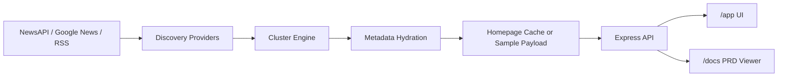

# Architecture Notes

This repository is a lightweight Node and Express prototype for the `Zelthir` news intelligence MVP.

## High-Level Flow

## Runtime Surfaces

- `server.mjs`
  Serves the app, the docs viewer, and the API endpoints.
- `public/index.html`
  Main grouped-news frontend.
- `index.html`
  Docs-style PRD viewer for `TECHNICAL_PRD.md`.

## API Endpoints

- `GET /`
  Redirects to `/app/`.
- `GET /api/home`
  Returns the cached or sample homepage payload.
- `POST /api/refresh`
  Forces a refresh of the homepage discovery pipeline.
- `GET /api/image?url=...`
  Proxies remote images to reduce broken publisher image loads.

## Ingest Pipeline

- `src/ingest/config.mjs`
  Reads environment variables and sets timeouts, refresh windows, and provider choices.
- `src/ingest/sourceRegistry.mjs`
  Defines section-level feed sources and source filters.
- `src/ingest/newsApiProvider.mjs`
  Pulls seed headlines and expansion queries from NewsAPI.
- `src/ingest/googleNewsProvider.mjs`
  Pulls Google News RSS seeds and related search expansions.
- `src/ingest/rssProvider.mjs`
  Pulls direct publisher RSS feeds.
- `src/ingest/discoveryAgent.mjs`
  Orchestrates providers, clustering, caching, and fallback behavior.

## Clustering and Enrichment

- `src/ingest/clusterEngine.mjs`
  Deduplicates articles, scores title and snippet overlap, and chooses canonical cluster entries.
- `src/ingest/articleMetadata.mjs`
  Resolves Google News redirects, fetches page metadata, and improves title, description, and image quality.
- `src/ingest/homeSample.mjs`
  Supplies bundled demo data when no cache exists.

## Frontend Responsibilities

- `public/app.js`
  Fetches homepage data, renders lead stories and sections, powers tabs, and opens grouped-coverage analysis views.
- `public/styles.css`
  Styles the dark newsroom-like UI for the main product surface.
- `app.js`
  Loads markdown, extracts PRD metadata, and builds a table of contents for the docs viewer.
- `styles.css`
  Styles the documentation surface.

## Operational Notes

- The repo intentionally does not commit `.env`.
- Generated live payloads under `data/` are excluded from git.
- The server auto-refreshes homepage discovery on an interval but remains usable without live credentials because the sample payload is bundled in source.
