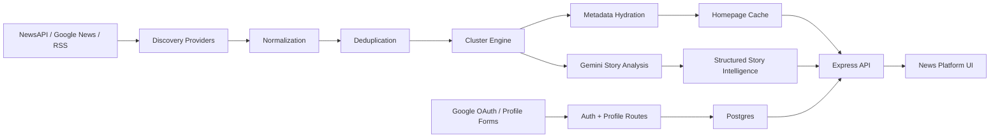

# Zelthir Architecture

Zelthir is a production-oriented news intelligence app. It ingests coverage from configured providers, normalizes and clusters related articles into story objects, enriches metadata, and generates structured story intelligence with Gemini.

## System Goals

- collect fresh coverage from NewsAPI, Google News, and RSS
- collapse duplicated or closely related reporting into story clusters
- present clustered stories with reliable source visibility and imagery
- generate a best-supported story account, claims, disputes, framing, Event Map, watch signals, and ripple effects
- persist authentication and reader profile state in Postgres
- support production sign-in with Google OAuth

## End-To-End Flow



## Local Runtime

The local app has three development services:

- Postgres from Docker Compose for users, sessions, OAuth accounts, login codes, and profile preferences.
- Express backend on `http://127.0.0.1:3210` for APIs, auth, ingestion, Gemini analysis, static serving, and health checks.
- Vite frontend on `http://127.0.0.1:5173` when running the frontend separately.

Production uses `server.mjs` as the Vercel entrypoint. Static files can be served by Express unless `SERVE_STATIC=false`.

## Runtime Components

### 1. Discovery Providers

Located under `src/ingest/`.

Responsibilities:

- fetch seed coverage from configured providers
- expand story candidates beyond a single homepage feed
- provide article breadth for multi-source clusters

Current providers:

- `newsApiProvider.mjs`: uses NewsAPI when a key is configured.
- `googleNewsProvider.mjs`: uses Google News feeds and search expansion.
- `rssProvider.mjs`: uses direct publisher RSS feeds as a fallback.

### 2. Normalization And Deduplication

Handled inside the ingest pipeline and cluster engine.

Responsibilities:

- convert heterogeneous provider payloads into one article shape
- normalize title, source, URL, snippet, timestamp, and image metadata
- remove exact duplicates and near-duplicate publisher rewrites

Normalized article shape:

```json
{
  "id": "string",
  "source": "string",
  "title": "string",
  "url": "string",
  "publishedAt": "ISO date",
  "snippet": "string",
  "imageUrl": "string|null",
  "section": "string",
  "language": "string"
}
```

### 3. Story Clustering

Primary file: `src/ingest/clusterEngine.mjs`

Responsibilities:

- compare article titles, snippets, timestamps, and source diversity
- merge related reporting into event-level story clusters
- choose a canonical title and representative imagery
- rank clusters for the homepage

Story cluster shape:

```json
{
  "clusterId": "string",
  "section": "usaDailyBriefing",
  "canonicalTitle": "string",
  "summary": "string",
  "whyItMatters": "string",
  "imageUrl": "string|null",
  "sourceCount": 103,
  "articleCount": 112,
  "latestPublishedAt": "ISO date",
  "articles": []
}
```

### 4. Metadata Hydration

Primary file: `src/ingest/articleMetadata.mjs`

Responsibilities:

- resolve Google News wrapper links to direct source URLs
- recover missing image, title, and description metadata
- improve publisher card quality when feed metadata is weak

This layer exists because publisher imagery is one of the most failure-prone parts of any news interface.

### 5. Gemini Story Analysis

Primary files:

- `src/ai/storyAnalysisProvider.mjs`
- `src/ai/geminiStoryAnalysis.mjs`

Responsibilities:

- build source-constrained story context from the selected cluster
- call Gemini when `AI_PROVIDER=gemini`
- request and validate schema-shaped JSON
- normalize output into UI fields
- provide fallbacks when generated analysis is partial

Structured analysis output includes:

```json
{
  "headline": "string",
  "brief": "string",
  "confidence": 82,
  "article_paragraphs": ["paragraph"],
  "agreed_claims": [],
  "disputed_claims": [],
  "frames": [],
  "topic_map": {
    "center": {},
    "topics": [],
    "edges": []
  },
  "watch_signals": [],
  "ripple_effects": {
    "24h": [],
    "7d": [],
    "30d": []
  }
}
```

### 6. Auth And Profile Persistence

Primary files:

- `src/server/authRoutes.mjs`
- `src/server/profileRoutes.mjs`
- `src/server/sessionCookies.mjs`
- `src/storage/postgresStore.mjs`

Responsibilities:

- expose available sign-in providers
- run Google OAuth production sign-in
- support development email-code sign-in when configured
- create, hash, validate, and clear session cookies
- store users, sessions, OAuth accounts, login codes, and profiles in Postgres

Implemented tables:

- `users`
- `login_codes`
- `sessions`
- `profiles`
- `profile_interests`
- `profile_locations`
- `oauth_accounts`

### 7. API Layer

Primary file: `server.mjs`

Responsibilities:

- serve the application shell and docs shell
- return cached homepage data
- trigger manual refreshes
- proxy remote imagery
- provide article metadata previews
- provide on-demand Gemini story analysis
- expose health, auth, profile, taxonomy, and source diagnostics

Current endpoints include:

- `GET /api/home`
- `POST /api/refresh`
- `GET /api/image?url=...`
- `GET /api/article-preview?url=...`
- `GET /api/ai/story?clusterId=...`
- `GET /api/health`
- `GET /api/auth/options`
- `POST /api/auth/start`
- `POST /api/auth/verify`
- `GET /api/auth/google/start`
- `GET /api/auth/google/callback`
- `GET /api/me`
- `PUT /api/me/profile`
- `POST /api/logout`
- `GET /api/taxonomy`
- `GET /api/sources`

### 8. Frontend

Primary files:

- `public/index.html`
- `public/app.js`
- `public/styles.css`

Responsibilities:

- render Pulse, Explore, and Story Intelligence
- manage sign-in, profile, and onboarding state
- show grouped source coverage for each cluster
- request story analysis when a story is opened
- render generated article text, claims, disputes, framing, Event Map, watch signals, and ripple effects
- degrade gracefully when live analysis or imagery is unavailable

## Intelligence Model

Zelthir uses a layered intelligence model.

### Base Layer

The homepage is built from provider feeds and the clustering engine.

Outputs:

- lead stories
- sectioned story grids
- grouped article rails
- source and article counts

### Story Intelligence Layer

Activated per cluster through `/api/ai/story`.

Outputs:

- source-backed brief
- agreed claims
- disputed claims
- framing signals
- Event Map
- watch signals
- ripple effects

### Event Map

The Event Map is rendered from the story analysis `topic_map` payload. It shows a central story node, related topics, and labeled edges so readers can inspect relationships without implying a separate graph database runtime.

### Predictive Layer

The predictive layer is generated as part of Gemini story analysis and normalized for the UI.

Outputs:

- likely near-term effects
- `24h / 7d / 30d` forecast buckets
- follow-up signals to monitor

Important accuracy note:

- this repository does not currently include a dedicated graph database runtime
- this repository does not currently include local model orchestration
- predictions are generated story-analysis fields, not a separate forecasting service

## Cache And Refresh Model

Homepage data is cached so the product can stay responsive even when provider calls are slow.

Behavior:

- server boots and attempts to ensure a non-empty homepage cache
- homepage refresh runs on an interval
- manual refresh is exposed through `POST /api/refresh`
- stale caches can still be served while a newer refresh is in progress

## Failure Modes And Degradation

### Provider Degradation

- if NewsAPI is unavailable, discovery can fall back to Google News and RSS
- if feed quality is poor, metadata hydration fills in missing fields when possible

### Image Degradation

- remote hotlinking failures are routed through `/api/image`
- if a cluster still lacks imagery, the frontend requests `/api/article-preview`

### Analysis Degradation

- if Gemini is unavailable or returns invalid output, the story view can still render fallback intelligence
- the UI upgrades in place when generated analysis succeeds

### Auth Degradation

- if Google OAuth is not configured, it is not advertised as an available option
- development email-code sign-in is separate from production Google OAuth
- profile routes require a valid session

## Operational Reality

The current codebase is deployable as an Express/Vercel app backed by Postgres and Gemini. The main implementation boundaries are:

- clustering is heuristic rather than embedding-native
- story analysis is Gemini-backed structured generation, not a separate graph runtime
- story and article clusters are cached rather than stored in normalized Postgres story tables
- the repository does not yet include an automated test suite

Those boundaries do not change the core architecture: Zelthir is a real news app with provider ingestion, cached clusters, production auth/profile persistence, and generated story intelligence.
